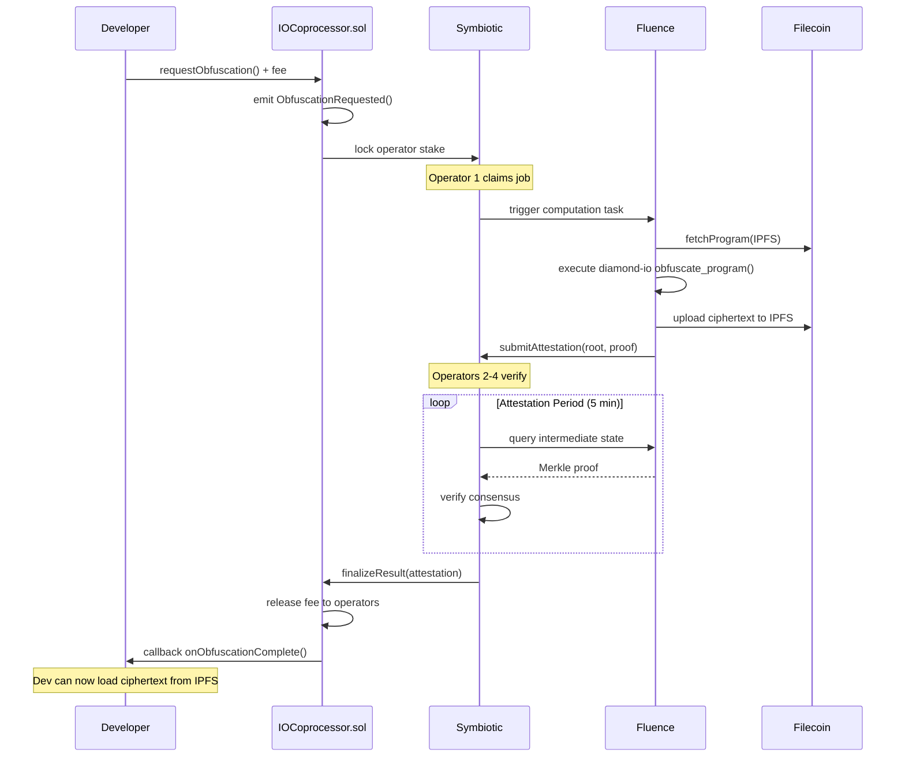

# IO Coprocessor Specification
## A Decentralized Indistinguishability Obfuscation Coprocessor for Smart Contracts

**Version**: 1.0  
**Target**: Hackathon Implementation  
**Status**: Specification Draft

---

## Executive Summary

The IO Coprocessor enables Solidity smart contracts to leverage Indistinguishability Obfuscation (iO) through a decentralized network of compute nodes. It combines Diamond iO (cryptographic primitives), Symbiotic (shared security & attestation), Fluence (decentralized compute execution), and Filecoin Onchain Cloud (verifiable storage) to create a permissionless, trustless obfuscation service that transforms arbitrary programs into cryptographically protected black boxes while maintaining on-chain verifiability.

---

## 1. Architecture Overview

### 1.1 High-Level Flow

```
┌─────────────────┐        ┌──────────────────┐        ┌──────────────────┐
│  Solidity       │        │  Symbiotic       │        │  Fluence         │
│  Smart Contract │───────▶│  (Events &       │───────▶│  Compute Network │
│                 │  Req   │  Attestation)    │  Task  │                  │
└─────────────────┘        └──────────────────┘        └──────────────────┘
        │                                                            │
        │                                                            ▼
        │                                              ┌──────────────────┐
        │                                              │  Diamond iO      │
        │                                              │  Obfuscation     │
        │                                              │  Engine          │
        │                                              └──────────────────┘
        │                                                            │
        ▼                                                            │
┌─────────────────┐        ┌──────────────────┐                      │
│  Filecoin       │◀───────┤  Ciphertext      │◀─────────────────────┘
│  Onchain Cloud  │  Store │  Program Result  │  Result
│  (IPFS)         │        │                  │
└─────────────────┘        └──────────────────┘
```

### 1.2 Core Components

| Component | Role | Technology | Network |
|-----------|------|------------|---------|
| **Request Portal** | On-chain interface for submitting obfuscation jobs | Solidity Smart Contract | Ethereum L2 (Base/Arbitrum) |
| **Security Layer** | Event emission, operator attestation, slashing | Symbiotic Protocol | Ethereum Mainnet |
| **Compute Layer** | Execute iO obfuscation algorithms | Fluence Network | Decentralized VMs |
| **Crypto Engine** | Diamond iO implementation (RLWE, trapdoors) | Rust + OpenFHE | WASM Runtime |
| **Storage Layer** | Store obfuscated programs & ciphertexts | Filecoin Onchain Cloud | IPFS + Filecoin |

---

## 2. Component Specifications

### 2.1 Request Portal (Solidity)

**Primary Contract: `IOCoprocessor.sol`**

```solidity
// SPDX-License-Identifier: MIT
pragma solidity ^0.8.20;

interface IIOCoprocessor {
    struct ObfuscationRequest {
        bytes32 programHash;    // IPFS hash of source program bytecode
        bytes32 inputSchema;    // ABI-encoded input structure
        uint256 securityParam;  // Security parameter λ (e.g., 128, 256)
        address callback;       // Contract to notify on completion
        bytes callbackData;     // Data for callback
        uint256 maxFee;         // Maximum fee willing to pay
    }

    struct ObfuscationResult {
        bytes32 ciphertextHash; // IPFS hash of obfuscated program
        address operator;       // Operator who performed obfuscation
        bytes32 attestation;    // Symbiotic attestation Merkle root
        uint256 timestamp;
        bool verified;
    }

    // Submit obfuscation request
    function requestObfuscation(ObfuscationRequest calldata request) 
        external payable returns (bytes32 requestId);

    // Retrieve result (after attestation)
    function getResult(bytes32 requestId) 
        external view returns (ObfuscationResult memory);

    // Callback function interface
    function onObfuscationComplete(
        bytes32 requestId,
        ObfuscationResult calldata result
    ) external;
}
```

**Key Features:**
- **Request Lifecycle**: Requests emit `ObfuscationRequested` event with requestId
- **Fee Escrow**: Fees held in contract until attestation verified
- **Operator Registration**: Operators stake via Symbiotic vaults to participate
- **Slashing Conditions**: Timeout, incorrect attestation, invalid ciphertext format

### 2.2 Symbiotic Integration (Security & Attestation)

**Operator Network Configuration**

```yaml
# symbiotic-config.yaml
network:
  name: "io-coprocessor-network"
  vaults:
    - collateral: "WETH"
      curator: "0xCuratorAddress"
      minStake: 1000e18  # 1000 WETH
  operators:
    - operatorId: "fluence-node-1"
      stakeAllocation: 500e18
      resolver: "0xResolverContract"
  slashing:
    timeout: 3600  # 1 hour
    invalidResult: 1000e18  # Slash amount
    falseAttestation: 2000e18  # Severe penalty
```

**Attestation Flow:**
1. **Primary Node** (first operator to claim): Executes Diamond iO obfuscation
2. **Attestation Nodes** (next 2-4 operators): Verify intermediate states
3. **Resolver Contract**: Validates Merkle root of computation trace
4. **Slashing**: Implemented via Symbiotic's `network.slash()` if attestation fails

**Attestation Structure:**
```solidity
struct ObfuscationAttestation {
    bytes32 requestId;
    bytes32 computationRoot;  // Merkle root of RAM snapshots
    bytes32 outputHash;       // Hash of obfuscated program
    address[] attesters;      // Operators who signed
    bytes32 resultProof;      // Succinct proof (future: zk-SNARK)
}
```

### 2.3 Fluence Compute Network

**Marine Wasm Module: `diamond-io-obfuscator.wasm`**

```rust
// lib.rs (compiled to WASM)
use marine_rs_sdk::marine;
use diamond_io::obfuscate;

#[marine]
pub struct ObfuscationParams {
    pub program_bytes: Vec<u8>,      // Program binary
    pub security_param: u32,          // λ parameter
    pub ring_dimension: u32,          // n parameter (power of 2)
    pub crt_depth: u32,               // Moduli count
}

#[marine]
pub struct ObfuscationOutput {
    pub ciphertext: Vec<u8>,         // Obfuscated program
    pub proof: Vec<u8>,              // Computation proof
    pub metrics: ComputeMetrics,
}

#[marine]
pub fn obfuscate_program(params: ObfuscationParams) -> ObfuscationOutput {
    // Initialize OpenFHE context
    let context = diamond_io::Context::new(params.security_param);
    
    // Execute obfuscation (memory-intensive)
    let obfuscated = obfuscate(&params.program_bytes, &context);
    
    // Generate computation trace for attestation
    let proof = generate_merkle_proof(&obfuscated);
    
    ObfuscationOutput {
        ciphertext: obfuscated.to_bytes(),
        proof,
        metrics: ComputeMetrics {
            cpu_time_ms: 0,  // Populated
            memory_gb: 0,     // Populated
        },
    }
}
```

**Aqua Orchestration Script:**
```aqua
-- io_orchestration.aqua
service IOCoprocessor("io-coprocessor-service"):
  obfuscate_program: ObfuscationParams -> ObfuscationOutput

func executeObfuscationJob(requestId: string, programCID: string, params: ObfuscationParams) -> ObfuscationResult:
  -- Primary node fetches program
  programBytes <- ipfs.get(programCID)
  params.program_bytes = programBytes
  
  -- Execute obfuscation
  result <- IOCoprocessor.obfuscate_program(params)
  
  -- Upload ciphertext to IPFS
  ciphertextCID <- ipfs.put(result.ciphertext)
  
  -- Emit attestation event
  co deal.notify(requestId, ciphertextCID, result.proof)
  
  <- ObfuscationResult(ciphertextCID, result.proof)
```

### 2.4 Filecoin Onchain Cloud Storage

**Synapse SDK Integration**
```typescript
// storage-client.ts
import { SynapseSDK } from '@filecoin/synapse';
import { ethers } from 'ethers';

const synapse = new SynapseSDK({
  network: 'filecoin-onchain-cloud',
  rpcUrl: 'https://api.node.glif.io',
  wallet: new ethers.Wallet(privateKey)
});

// Store obfuscated program
async function storeProgram(ciphertext: Uint8Array): Promise<string> {
  // Pin to IPFS via Filecoin Pin service
  const cid = await synapse.pin.cid({
    data: ciphertext,
    replication: 3,           // 3 copies
    duration: 365 * 24 * 60 * 60 * 1000,  // 1 year
    payment: 'prep'
  });
  
  // Verify onchain proof
  const proof = await synapse.proof.verify(cid);
  if (!proof.isValid) throw new Error('Storage proof failed');
  
  return cid;
}

// Retrieve with incentivized retrieval
async function retrieveProgram(cid: string): Promise<Uint8Array> {
  return await synapse.beam.retrieve(cid, {
    maxPrice: 100,  // FIL per GB
    timeout: 30000
  });
}
```

**Onchain Storage Contract (ERC-3668 compliant)**
```solidity
// IOP_Storage.sol
contract IOPStorage {
    mapping(bytes32 => string) public programCID;  // requestId -> IPFS CID
    mapping(string => bytes32) public cidToHash;   // CID -> content hash
    
    event ProgramStored(bytes32 indexed requestId, string cid, bytes32 contentHash);
    
    function storeResult(
        bytes32 requestId,
        string calldata cid,
        bytes32 contentHash,
        bytes calldata storageProof
    ) external {
        // Verify storage proof against Filecoin Onchain Cloud
        require(verifyFILProof(storageProof, cid), "Invalid storage proof");
        
        programCID[requestId] = cid;
        cidToHash[cid] = contentHash;
        
        emit ProgramStored(requestId, cid, contentHash);
    }
}
```

---

## 3. Integration Flow

### 3.1 Complete Obfuscation Job Flow



### 3.2 Event Schemas

**Solidity Events:**
```solidity
event ObfuscationRequested(
    bytes32 indexed requestId,
    address indexed requester,
    bytes32 programHash,
    uint256 securityParam,
    uint256 fee
);

event ComputationStarted(
    bytes32 indexed requestId,
    address indexed operator,
    uint256 timestamp
);

event AttestationSubmitted(
    bytes32 indexed requestId,
    address indexed operator,
    bytes32 attestationRoot,
    uint256 stakeAmount
);

event ObfuscationComplete(
    bytes32 indexed requestId,
    string ciphertextCID,
    bytes32 contentHash
);
```

---

## 4. Developer API

### 4.1 Solidity Integration

```solidity
// Example: FHE-like encrypted counter using iO
contract PrivateCounter {
    IIOCoprocessor public coprocessor;
    bytes32 public obfuscatedProgramId;
    
    // Initialize with obfuscated increment program
    function initialize(bytes32 programCID) external {
        IIOCoprocessor.ObfuscationRequest memory req = IIOCoprocessor.ObfuscationRequest({
            programHash: programCID,
            inputSchema: keccak256("increment(uint256)"),
            securityParam: 128,
            callback: address(this),
            callbackData: "",
            maxFee: 1 ether
        });
        
        obfuscatedProgramId = coprocessor.requestObfuscation{value: 1 ether}(req);
    }
    
    // Callback when obfuscation complete
    function onObfuscationComplete(
        bytes32 requestId,
        IIOCoprocessor.ObfuscationResult calldata result
    ) external {
        require(requestId == obfuscatedProgramId, "Invalid request");
        // Store ciphertext CID for later execution
    }
}
```

### 4.2 JavaScript/TypeScript SDK

```typescript
import { IOCoprocessor } from '@io-coprocessor/sdk';
import { ethers } from 'ethers';

const io = new IOCoprocessor({
  rpcUrl: 'https://mainnet.infura.io',
  coprocessorAddress: '0x...',
  symbioticResolver: '0x...',
  fluencePeerId: '12D3KooW...'
});

// Simple API
async function obfuscateAndDeploy(program: Uint8Array) {
  // 1. Upload program to IPFS
  const programCID = await io.storage.upload(program);
  
  // 2. Submit obfuscation request
  const requestId = await io.coprocessor.requestObfuscation({
    programHash: programCID,
    securityParam: 128,
    fee: ethers.utils.parseEther('1.0')
  });
  
  // 3. Wait for completion (with attestation)
  const result = await io.coprocessor.waitForResult(requestId);
  
  // 4. Verify attestation onchain
  const isValid = await io.symbiotic.verifyAttestation(
    result.attestation,
    result.operator
  );
  
  // 5. Use obfuscated program
  return {
    ciphertextCID: result.ciphertextHash,
    verified: isValid
  };
}
```

---

## 5. Security Considerations

### 5.1 Threat Model

| Threat | Impact | Mitigation |
|--------|--------|------------|
| Malicious Operator | Invalid obfuscation | Symbiotic slashing + attestation consensus |
| Computation Timeout | Resource exhaustion | Fluence deal timeouts + fee burning |
| Ciphertext Tampering | Wrong program behavior | Filecoin content addressing (CID) |
| Front-running | Request stealing | Commit-reveal scheme for job claims |
| Storage Unavailability | Data loss | Filecoin replication (3+ copies) + pinning |

### 5.2 Cryptographic Parameters

**Default Security Levels:**
```rust
// Recommended parameters for hackathon
pub const HACKATHON_PARAMS: ObfuscationParams = ObfuscationParams {
    security_param: 128,      // 128-bit security
    ring_dimension: 4096,      // n = 2^12
    crt_depth: 5,              // 5 moduli for correctness
    base_bits: 24,             // Decomposition base
    d: 8,                      // Secret key dimension
};
```

**Production Security Levels:**
```rust
pub const PRODUCTION_PARAMS: ObfuscationParams = ObfuscationParams {
    security_param: 256,      // 256-bit security
    ring_dimension: 16384,     // n = 2^14
    crt_depth: 8,              // 8 moduli
    base_bits: 32,
    d: 16,
};
```

### 5.3 Slashing Conditions

**Symbiotic Slashing Rules:**
```solidity
// Implemented in network-specific resolver
function slashOperator(
    address operator,
    bytes32 requestId,
    SlashReason reason
) internal {
    if (reason == SlashReason.TIMEOUT) {
        // Operator failed to complete in 1 hour
        symbiotic.slash(operator, 1000e18); // 1000 WETH
    } else if (reason == SlashReason.INVALID_ATTESTATION) {
        // Attestation verification failed
        symbiotic.slash(operator, 2000e18); // Severe penalty
    }
}
```

---

## 6. Economic Model

### 6.1 Pricing Structure

```typescript
interface FeeStructure {
  // Base fee covers Fluence compute costs
  baseFee: bigint;           // USDC per CPU-second
  
  // Security fee for Symbiotic stake locking
  securityFee: bigint;       // 5% of baseFee
  
  // Storage fee for Filecoin Onchain Cloud
  storageFeePerGB: bigint;   // FIL per TB-month
  
  // Attestation fee for validator set
  attestationFee: bigint;    // Split among 3-5 attesters
}

const HACKATHON_PRICING: FeeStructure = {
  baseFee: 0.0001e6,        // $0.0001 per CPU-second (USDC)
  securityFee: 0.000005e6,  // $0.000005 (5%)
  storageFeePerGB: 5.99e18, // $5.99/TB/month (via Storacha)
  attestationFee: 0.00002e6 // $0.00002 split among attesters
};
```

### 6.2 Staking Requirements

**Operator Stake Tiers:**
- **Tier 1 (Primary)**: 1000 WETH minimum stake (executes obfuscation)
- **Tier 2 (Attester)**: 500 WETH minimum stake (verifies results)
- **Slashing Amount**: Up to 50% of stake for critical failures

---

## 7. Implementation Roadmap

### Phase 1: Hackathon MVP (Week 1)

- [ ] Deploy `IOCoprocessor.sol` to testnet (Base Sepolia)
- [ ] Integrate Symbiotic testnet for operator registration
- [ ] Wrap Diamond iO as Fluence Marine module
- [ ] Implement basic obfuscation flow (dummy parameters)
- [ ] Store ciphertext on Filecoin calibration network
- [ ] Create sample Solidity contract that uses obfuscated program

**Acceptance Criteria:**
- Successfully obfuscate a 4-bit AND gate circuit
- End-to-end flow in <5 minutes on testnet
- At least 2 operators in attestation set

### Phase 2: Pre-Production (Week 2-4)

- [ ] Optimize Diamond iO for WASM (memory management)
- [ ] Implement complete attestation protocol with Merkle proofs
- [ ] Add slashing resolver contracts
- [ ] Integrate Synapse SDK for production Filecoin storage
- [ ] Create TypeScript SDK with automatic fee estimation
- [ ] Benchmark with real parameters (128-bit security)

### Phase 3: Production (Month 2-3)

- [ ] Deploy to Ethereum mainnet with Symbiotic mainnet
- [ ] Implement zk-SNARK proofs for attestation (succinct verification)
- [ ] Add support for multiple security levels
- [ ] Create operator marketplace UI
- [ ] Audit all contracts and crypto implementation

---

## 8. Example Use Cases

### 8.1 Private DeFi Logic
```solidity
// Obfuscate AMM pricing formula to prevent MEV
contract PrivateAMM {
    bytes32 public obfuscatedSwapProgram;
    
    function swap(uint256 amountIn) external {
        // Load obfuscated program from IPFS
        bytes memory program = ioStorage.load(obfuscatedSwapProgram);
        
        // Execute using IO coprocessor (off-chain)
        uint256 amountOut = IOCoprocessor.execute(program, amountIn);
        
        // Transfer tokens based on obfuscated calculation
    }
}
```

### 8.2 Onchain Gaming with Hidden Mechanics
```solidity
// Game logic cannot be reverse-engineered
contract StrategyGame {
    function commitMove(bytes32 encryptedMove) external {
        // Move is processed by obfuscated program
        // No player can cheat by analyzing contract logic
    }
}
```

### 8.3 Proprietary Algorithm Licensing
```solidity
contract LicensedAlgorithm {
    // Algorithm provider obfuscates their IP
    // Users pay per execution without accessing source
    function runAlgorithm(bytes memory input) external payable {
        require(msg.value >= feePerRun, "Insufficient fee");
        IOCoprocessor.execute(algorithmCID, input);
    }
}
```

---

## 9. Deployment Configuration

### 9.1 Testnet Addresses (Hackathon)

| Network | Contract | Address |
|---------|----------|---------|
| Base Sepolia | IOCoprocessor | `0x...` (deployed) |
| Symbiotic Testnet | Resolver | `0x...` |
| Fluence Testnet | Peer Multiaddr | `/dns4/.../tcp/...` |
| Filecoin Calibration | Synapse Gateway | `https://calibration.synapse.vercel.app` |

### 9.2 Environment Variables

```bash
# Fluence
FLUENCE_PEER_ID=12D3KooW...
FLUENCE_PRIVATE_KEY=0x...

# Symbiotic
SYMBIOTIC_NETWORK_ID=123
SYMBIOTIC_RESOLVER_ADDRESS=0x...
OPERATOR_PRIVATE_KEY=0x...

# Filecoin
SYNAPSE_API_KEY=...
FIL_WALLET_PRIVATE_KEY=0x...

# Diamond iO
OPENFHE_LIB_PATH=/usr/local/lib/libOPENFHE.so
RUST_BACKTRACE=1
```

---

## 10. Performance Targets

| Metric | Hackathon Target | Production Target |
|--------|------------------|-------------------|
| **Obfuscation Time** | <5 min (dummy params) | <1 hour (real params) |
| **Attestation Time** | 2-3 min (3 operators) | 10-15 min (5 operators) |
| **Storage Latency** | <30s (IPFS fetch) | <5s (Filecoin Beam) |
| **Gas Cost** | <200k gas (request) | <100k gas (with zk-proof) |
| **Memory Usage** | <16GB RAM | <128GB RAM (disk-backed) |
| **Ciphertext Size** | ~100MB (small circuit) | ~10GB (complex program) |

---

## 11. Testing Strategy

### 11.1 Test Suite

```javascript
// Test obfuscation correctness
describe("IO Coprocessor", () => {
  it("should obfuscate 4-bit circuit correctly", async () => {
    const program = compileCircuit("AND(a,b)");
    const { ciphertextCID } = await obfuscateAndDeploy(program);
    
    // Execute with inputs
    const result = await executeObfuscated(ciphertextCID, [1, 1]);
    expect(result).to.equal(1);
  });
  
  it("should slash operator on timeout", async () => {
    const requestId = await submitRequest();
    await increaseTime(3601); // 1 hour + 1 second
    
    const operatorStakeBefore = await symbiotic.getStake(operator);
    await symbiotic.checkSlash(requestId);
    const operatorStakeAfter = await symbiotic.getStake(operator);
    
    expect(operatorStakeAfter).to.be.lt(operatorStakeBefore);
  });
});
```

### 11.2 Benchmark Circuits
- **4-bit AND gate** (simplest)
- **AES-128 encryption** (realistic)
- **SHA-256 hash** (complex)
- **TinyML inference** (practical AI)

---

## 12. References

- **Diamond iO Paper**: https://eprint.iacr.org/2025/236
- **Diamond iO Repo**: https://github.com/MachinaIO/diamond-io
- **Symbiotic Docs**: https://docs.symbiotic.fi/
- **Fluence Network**: https://fluence.network/
- **Filecoin Onchain Cloud**: https://filecoin.io/blog/posts/introducing-filecoin-onchain-cloud/
- **OpenFHE**: https://openfhe-development.readthedocs.io/

---

## Appendix A: Quickstart Guide

```bash
# 1. Clone repositories
git clone https://github.com/MachinaIO/diamond-io
git clone https://github.com/your-io-coprocessor/repo

# 2. Install dependencies
cd diamond-io
./install-openfhe.sh
cargo build --release

# 3. Build WASM module
./build-fluence-module.sh

# 4. Deploy contracts
cd contracts
npm install
npx hardhat run scripts/deploy.js --network baseSepolia

# 5. Run operator node
cd operator
npm start -- --stake 1000 --network symbiotic-testnet

# 6. Submit test request
cd examples
node submit-obfuscation.js --program circuits/and4.circ
```

---

**Last Updated**: 2025-11-22  
**Maintainer**: Hackathon Team  
**License**: MIT (Diamond iO), Apache 2.0 (Coprocessor)
