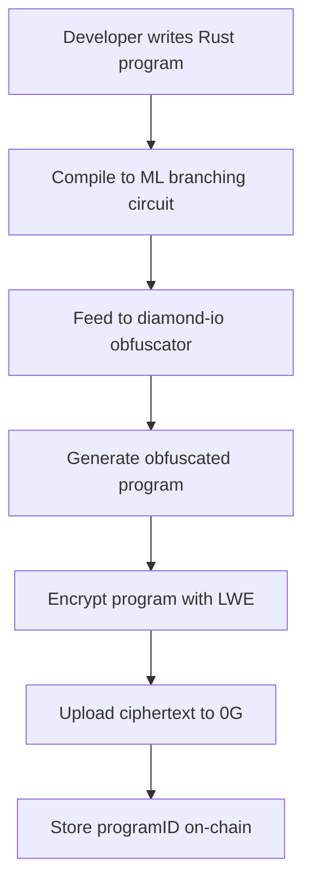
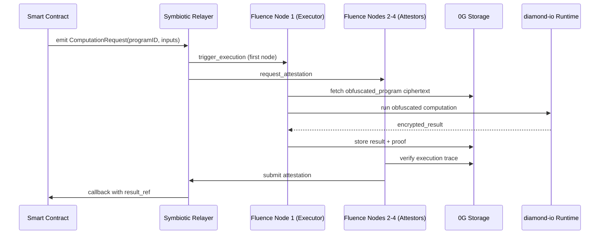

I'll fetch the repository to understand its structure and help you create a comprehensive spec for your hackathon project.
# IO Coprocessor Specification for Decentralized ML Training

## Project Overview

The **IO Coprocessor** is a decentralized infrastructure that enables Ethereum smart contracts to leverage **Indistinguishability Obfuscation (iO)** for privacy-preserving computation. Built on [MachinaIO's diamond-io](https://github.com/MachinaIO/diamond-io) implementation, this system allows Solidity contracts to outsource complex obfuscated computations off-chain while maintaining cryptographic guarantees.

**Key Innovation**: Developers can write IO applications without managing the underlying cryptography, similar to how FHE coprocessors abstract away homomorphic encryption complexity.

---

## Architecture

### System Components

```
┌─────────────────────────────────────────────────────────────────────┐
│                        USER LAYER (Solidity)                        │
│  contract MLTraining {                                              │
│    function submitModel(bytes memory encryptedModel) external      │
│  }                                                                  │
└────────────────────────────────────┬────────────────────────────────┘
                                     │
                                     │ 1. Event Emission
                                     ▼
┌─────────────────────────────────────────────────────────────────────┐
│                    SYMBIOTIC RELAYER LAYER                          │
│  - Event listening & attestation                                    │
│  - Quorum formation for operation initiation                        │
│  - First node triggers, rest attest                                 │
└────────────────────────────────────┬────────────────────────────────┘
                                     │
                                     │ 2. Trigger + Attestations
                                     ▼
┌─────────────────────────────────────────────────────────────────────┐
│                    FLUENCE COMPUTATION LAYER                        │
│  - Decentralized compute network                                    │
│  - Runs diamond-io obfuscated programs                              │
│  - Execute ML training on encrypted data                            │
└────────────────────────────────────┬────────────────────────────────┘
                                     │
                                     │ 3. Store/Retrieve
                                     ▼
┌─────────────────────────────────────────────────────────────────────┐
│                        0G STORAGE LAYER                             │
│  - Encrypted model parameters                                       │
│  - Obfuscated program binaries                                      │
│  - Training metadata & proofs                                       │
└─────────────────────────────────────────────────────────────────────┘
```

---

## Core Workflow

### 1. Program Obfuscation Flow


### 2. Execution Flow


---

## Integration Specifications

### Smart Contract Interface

```solidity
// SPDX-License-Identifier: MIT
pragma solidity ^0.8.20;

interface IIOCoprocessor {
    // Events
    event ComputationRequested(
        bytes32 indexed jobId,
        bytes32 programId,
        bytes inputs,
        address callback
    );
    
    event ComputationCompleted(
        bytes32 indexed jobId,
        bytes32 resultRef,
        bytes[] attestations
    );

    // Submit obfuscated computation
    function requestComputation(
        bytes32 programId,
        bytes calldata inputs,
        address callbackContract
    ) external payable returns (bytes32 jobId);

    // Register new obfuscated program
    function registerProgram(
        bytes32 programId,
        string calldata ciphertextRef,
        bytes calldata verificationKey
    ) external;
}

// Example ML Training Contract
contract DecentralizedML is IIOCoprocessorCallback {
    IIOCoprocessor public coprocessor;
    
    function trainModel(bytes memory encryptedDataset) external {
        // Program ID for obfuscated SGD training
        bytes32 programId = 0x...;
        
        // Request computation
        coprocessor.requestComputation(
            programId,
            encryptedDataset,
            address(this)
        );
    }
    
    function receiveResult(
        bytes32 jobId,
        bytes32 resultRef
    ) external override {
        // Handle trained model
        emit ModelTrained(jobId, resultRef);
    }
}
```

### Symbiotic Relayer Configuration

```yaml
# symbiotic-config.yaml
network: holesky
operator_quorum: 4
task_reward: 0.001 ETH

attestation:
  type: TEE_attestation
  required_signatures: 3
  
execution:
  strategy: first_node_triggers
  timeout: 600s
  retry_attempts: 2
```

### Fluence Compute Module

```rust
// fluence-io-module/src/lib.rs
use diamond_io::{ObfuscatedProgram, LWEParams};
use fluence::marine;

#[marine]
pub fn execute_obfuscated(
    program_ciphertext: Vec<u8>,
    inputs: Vec<u8>,
    lwe_params: LWEParams,
) -> Result<Vec<u8>, String> {
    // Initialize diamond-io runtime
    let runtime = diamond_io::Runtime::new(lwe_params)
        .map_err(|e| format!("Runtime init failed: {}", e))?;
    
    // Execute obfuscated program
    let result = runtime.execute(&program_ciphertext, &inputs)
        .map_err(|e| format!("Execution failed: {}", e))?;
    
    Ok(result)
}

#[marine]
pub fn generate_proof_of_contribution(
    execution_trace: Vec<u8>,
    node_key: String,
) -> Result<Vec<u8>, String> {
    // Create contribution proof for ML training
    // Includes TEE attestation + execution verification
}
```

---

## Decentralized ML Training Use Case

### Protocol: Privacy-Preserving Federated Learning with iO

**Goal**: Enable nodes to contribute encrypted data to model training without revealing:
- Raw data
- Model architecture
- Individual contributions

**Architecture**:
```
Client Nodes → Encrypt local data (LWE) → Submit to 0G
                                       ↓
Aggregator → Triggers obfuscated training program via Symbiotic
                                       ↓
Fluence Nodes → Execute diamond-io obfuscated SGD
                                       ↓
0G → Store encrypted model updates
                                       ↓
Proof of Contribution → On-chain verification
```

### Proof of Contribution Mechanism

Each Fluence node generates a proof including:
1. **TEE Attestation**: Proves execution in secure enclave
2. **Execution Trace**: Commitment to computation steps
3. **LWE Ciphertext**: Encrypted intermediate result
4. **ZK Proof**: Verifies correct obfuscation evaluation

```rust
struct ContributionProof {
    pub node_id: PublicKey,
    pub tee_quote: Vec<u8>,           // Intel SGX/AMD SEV quote
    pub execution_hash: [u8; 32],     // Hash of obfuscated execution
    pub ciphertext_proof: ZKProof,    // Proves ciphertext validity
    pub stake_amount: U256,
}
```

---

## API for Developers

### 1. Obfuscate a Program

```bash
# Install diamond-io CLI
cargo install --git https://github.com/MachinaIO/diamond-io

# Obfuscate a Rust function
diamond-io obfuscate \
  --source model_training.rs \
  --security-params lwe_params.json \
  --output obfuscated.bin \
  --circuit-type ml_sgd

# Upload to 0G
0g-storage upload obfuscated.bin --tags io-program
```

### 2. Register with Coprocessor

```typescript
// JavaScript SDK for IO Coprocessor
import { IOCoprocessorSDK } from '@machinaio/coprocessor-sdk';

const sdk = new IOCoprocessorSDK({
  rpc: 'https://ethereum-holesky.publicnode.com',
  symbioticAPI: 'https://api.symbiotic.fi',
  fluenceNetwork: 'testnet'
});

// Register program
const programId = await sdk.registerProgram({
  ciphertextRef: '0g://program/obfuscated.bin',
  lweParams: './lwe_params.json',
  verificationKey: './vk.bin'
});

// Request computation
const job = await sdk.requestComputation({
  programId,
  inputs: encryptedDataset,
  callback: (result) => {
    console.log('Training complete:', result);
  }
});
```

### 3. Write an IO Application

```rust
// io-app/src/main.rs
use diamond_io_macros::io_program;

#[io_program]
fn private_gradient_descent(
    encrypted_data: LWEEncrypted<Vec<f64>>,
    learning_rate: f64,
    epochs: u32,
) -> LWEEncrypted<Vec<f64>> {
    // This code runs inside obfuscated program
    // Cannot be reverse-engineeredeven by executing nodes
    let mut weights = initialize_weights();
    
    for _ in 0..epochs {
        let grads = compute_gradients(&encrypted_data, &weights);
        weights = update_weights(weights, grads, learning_rate);
    }
    
    encrypt(weights) // Return encrypted model
}
```

---

## Security Assumptions & Parameters

### Cryptographic Assumptions
- **Learning With Errors (LWE)**: Standard lattice hardness
- **Evasive LWE**: For obfuscation security [Diamond iO paper](https://eprint.iacr.org/2025/236)
- **All-Product LWE**: New assumption introduced in diamond-io
- **TEE Security**: Intel SGX or AMD SEV for attestation

### Recommended Parameters (for hackathon)
```json
{
  "lwe_dimension": 1024,
  "log_q": 64,
  "error_distribution": "gaussian_std_3_2",
  "security_level": "128_bit_classical",
  "circuit_depth": 20,
  "obfuscation_overhead": "2^25"
}
```

---

## Hackathon Implementation Roadmap

### Phase 1: MVP (24 hours)
- [ ] Deploy diamond-io runtime to single Fluence node
- [ ] Create Solidity contract with basic request/response
- [ ] Set up Symbiotic relayer for event listening
- [ ] Store/retrieve simple ciphertext from 0G
- [ ] **Deliverable**: Obfuscated "hello world" computation

### Phase 2: ML Training Core (24 hours)
- [ ] Implement obfuscated linear regression in diamond-io
- [ ] Create proof of contribution mechanism
- [ ] Multi-node attestation via Symbiotic
- [ ] **Deliverable**: Train model on encrypted 2D points

### Phase 3: Integration & Demo (24 hours)
- [ ] Full end-to-end pipeline
- [ ] SDK for developers
- [ ] UI dashboard showing:
  - Live attestation quorum
  - Encrypted model convergence
  - Proof of contribution verification
- [ ] **Deliverable**: Decentralized ML training demo with 3 nodes

---

## File Structure

```
io-coprocessor/
├── contracts/
│   ├── IOCoprocessor.sol
│   ├── IIOCoprocessorCallback.sol
│   └── DecentralizedML.sol
├── relayer/
│   ├── symbiotic-config.yaml
│   ├── event-listener.ts
│   └── attestation-aggregator.ts
├── fluence-modules/
│   ├── io-executor/
│   │   ├── Cargo.toml
│   │   └── src/lib.rs
│   └── proof-generator/
│       └── src/lib.rs
├── sdk/
│   ├── typescript/
│   │   └── src/coprocessor.ts
│   └── rust/
│       └── src/lib.rs
├── programs/
│   ├── Cargo.toml
│   └── src/linear_regression.rs
└├── scripts/
    ├── deploy.sh
    └── demo.sh
```

---

## Performance Targets

| Component | Target | Notes |
|-----------|--------|-------|
| Obfuscation time | < 5 min | For simple ML models (100 params) |
| Execution time | < 30 sec | On Fluence TEE instance |
| Attestation quorum | < 10 sec | 3/4 nodes signing |
| Proving overhead | 2x-3x | vs plaintext execution |
| Storage cost | ~0.001 ETH/GB/month | On 0G testnet |

---

## Risks & Mitigations

| Risk | Impact | Mitigation |
|------|--------|------------|
| diamond-io instability | High | Pin to v1.5.0, have fallback FHE mode |
| Symbiotic testnet down | Medium | Use local relayer mock |
| 0G latency | Medium | Cache programs in Fluence IPFS |
| TEE attestation failure | Medium | Allow ZK-only proofs temporarily |
| LWE parameter choice | High | Use recommended params from paper |

---

## Team Roles (for hackathon)

1. **Solidity Dev**: Contract interfaces & Symbiotic integration
2. **Rust/Crypto Dev**: diamond-io program development & Fluence modules
3. **DevOps**: 0G storage & network deployment
4. **Full-Stack**: SDK & demo UI

---

## Resources

- **diamond-io**: https://github.com/MachinaIO/diamond-io
- **Paper**: https://eprint.iacr.org/2025/236
- **Symbiotic**: https://symbiotic.fi
- **Fluence**: https://fluence.network
- **0G**: https://0g.ai
- **MachinaIO**: https://pse.dev/projects/machina-io

---

## Success Criteria

✅ Execute obfuscated program on Fluence via smart contract call  
✅ 4-node Symbiotic quorum with attestation  
✅ Store >1GB encrypted model on 0G  
✅ Generate verifiable proof of contribution  
✅ Demo: Train linear regression on 3 encrypted datasets  

---

**Note**: This is experimental cryptography. diamond-io is MVP-level software. For hackathon purposes, start with trivial programs and gradually increase complexity. The goal is demonstrating the coprocessor architecture, not production-ready iO (yet!).
